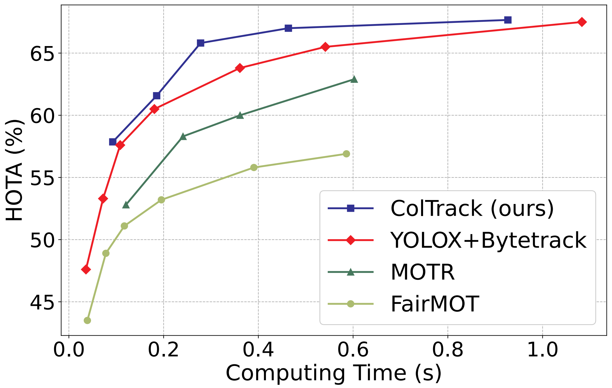
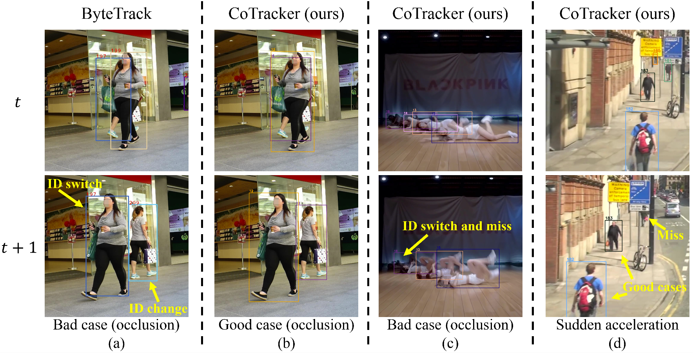

# ColTrack

#### ColTrack not only outperforms state-of-the-art methods on large-scale datasets under high frame rates but also achieves higher and more stable performance under low frame rates. This allows it to obtain a higher equivalent FPS by reducing the frame rate requirement.

> [**ColTrack: Collaborative Tracking Learning for Frame-Rate-Insensitive Multi-Object Tracking**](https://arxiv.org/abs/2308.05911)
> 
> [Yiheng Liu](https://yolomax.com/), Junta Wu, Yi Fu
> 
> *[arXiv:2308.05911](https://arxiv.org/abs/2308.05911)*

## News
* (2023.09.22) The code is in the company's open source review process and will be available soon. 
* (2023.07) Our paper is accepted by ICCV 2023!

## Tracking performance
| Dataset    |  HOTA | MOTA | IDF1 |
|------------|-------|------|------|
|MOT17       | 61.0 | 78.8 | 73.9 | 
|Dancetrack  | 72.6 | 92.1 | 74.0 | 
|Dancetrack(+val)  | 75.3 | 92.2 | 77.3 | 

### Visualization results on MOT challenge test set

